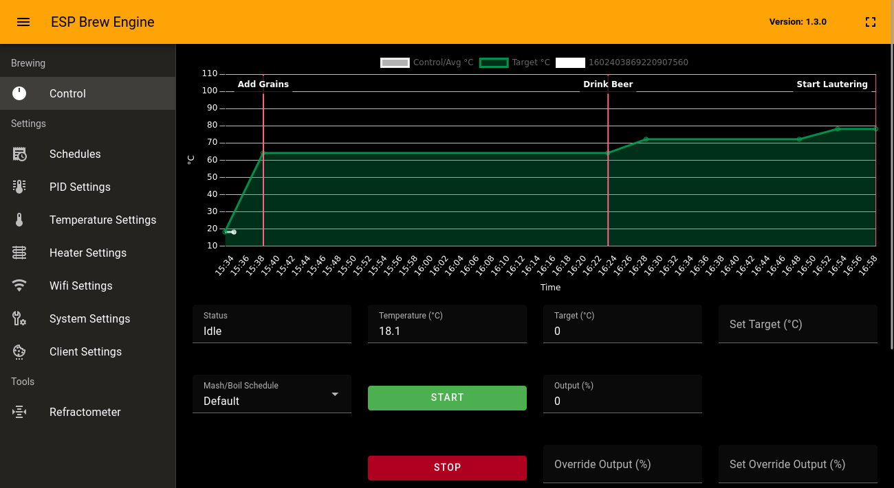
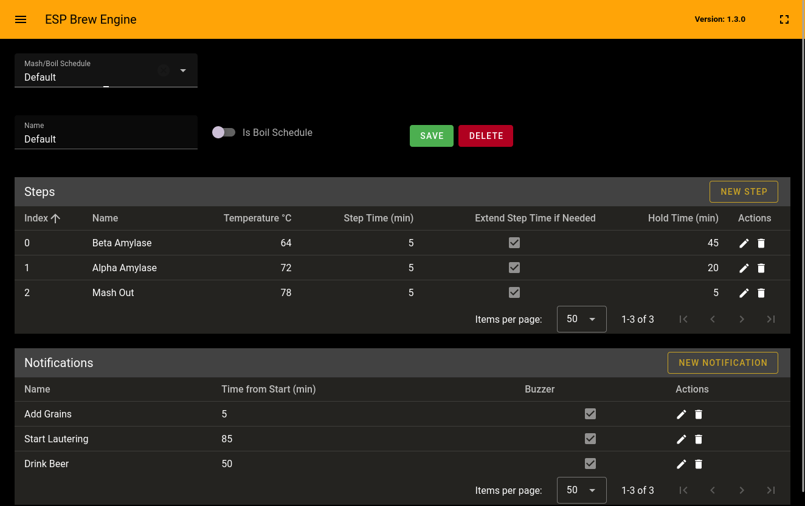

# ESP Brew Engine

## Description

ESP Brew Engine is a brew controller for ESP32, it can be used to control maish and cooking.

It is open source and build in c++ using esp-idf RTOS.

## Features

- Multiple Configurable Maish Schedules.
- Configurable PID control.
- Up to 10 Configurable Heaters.
- Up to 10 One-wire Sensors.
- Automatic Stirring / Pumping Intervals.
- Temperature logging to MQTT.
- OTA Firmware update.
- Ability to enable/disable/detect sensors at runtime.
- Ability to specify Absolute and Relative Compensation.
- Support for Celsius and Fahrenheit.
- Support for Buzzer.
- Support for Notifications.
- Speech Notificaitons via webinterface.
- Import BeerXML.
- Dark/Light Theme.
- 2 PID settings, one for mash and one for boil.

## Screenshots




## Supported Devices

It should work with most esp32 controllers, but the easiest way is to use an esp board which already has 4 relays on it.


## How to use (binary with loader)

Its recomended to flash with loader, that way you can always go into recovery mode and flash new firmwares over wifi.

https://github.com/jeroen79/esp-brew-engine/wiki/How-to-use-(binary-with-loader)


## How to use (source with loader)

Its recomended to flash with loader, that way you can always go into recovery mode and flash new firmwares.

https://github.com/jeroen79/esp-brew-engine/wiki/How-to-use-(source-with-loader)

## How to use (source without loader)

https://github.com/jeroen79/esp-brew-engine/wiki/How-to-use-(source-without-loader)


## Factory Reset

https://github.com/jeroen79/esp-brew-engine/wiki/Factory-Reset


## Wifi

To configure wifi either do idf.py menuconfig, and configure wifi SSID and password, or let esp-brew-engine start an access point wich you can connect to and configure wifi in the webinterface.

Be sure to at least change te password!, but it is also recommended to swith to station mode instead of ap!

Default Wifi settings are:
SSID: EspBrewEngine
Password: EspBrewEngine123

## Connecting with Browser

Just open your browser and enter http://BrewEngine, or if still in access point mode http://192.168.4.1

Hostname can also be changed via menuconfig.

*Dns does not work when in access point mode, esp-idf doesn't have a dns server atm. 


## Debug

```bash
idf.py monitor 
```

To quit Ctrl-T Ctrl-X.


## Connect sensors

https://github.com/jeroen79/esp-brew-engine/wiki/One-Wire-Sensors

## Planned Features (possible)
- Backup and Restore config data.
- Resume maish from custom timepoint.
- Pauze function.
- Dns server so when in AP mode the resolving the hostname works.
- HW Display (show temp/target).
- HW Control Buttons (emergecy stop, stop/start stir?).